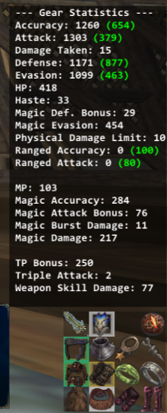
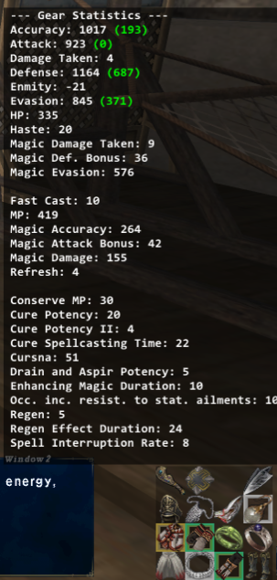
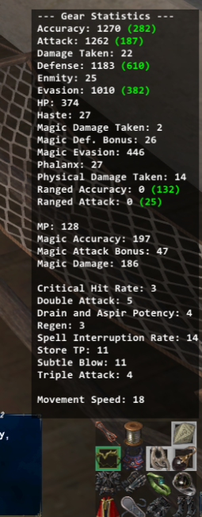
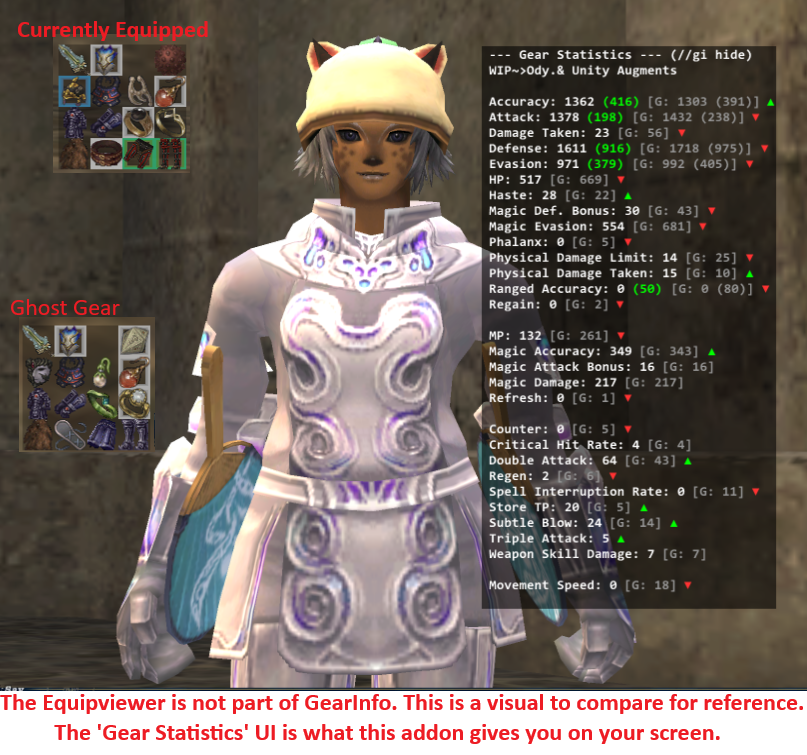

# GearInfo

$\color{red}{\text{WIP}}$ - Gotta manually add ranks for all ody and limbus and this will be done-done. 7/10  But everything else works.

This version of GearInfo is a lightweight Windower addon designed to track and display your equipment statistics in real-time. Unlike the older version which dealt with hardcoded stuffs, I'm using dynamic pattern matching (Regex) to read base stats and custom augments directly from your equipped items, ensuring your data is always accurate regardless of recent game updates or random gear rolls. **You will NOT need to incoorporate this into GearSwap. This is stand-alone.**

## Features
* **Dynamic Parsing:** Automatically detects stats from base gear and custom augments (Oseem, Odyssey, etc.) using real-time game data. I handle complex augment strings and prevents double-counting of stats (e.g., differentiating between "Accuracy" and "Magic Accuracy").
* **Odyssey & Unity Rank Scaling:** Full support for Rank 1 through 30 path-based augment scaling via a dedicated `exceptions.lua` database, allowing perfect calculations of intermediate ranks. $\color{red}{\text{WIP}}$
* **Ghost Gear System:** Save a "ghost" snapshot of your stats in memory. Your ghost stats hover next to your active stats in brackets `[G: ...]` so you can rapidly compare gear sets in real-time.
    * **Smart Comparisons:** The UI automatically calculates the difference between your active gear and your ghost snapshot, displaying a smooth, color-coded green $\color{green}{\text{▲}}$ or $\color{red}{\text{▼}}$ to instantly show you what you're gaining or losing.
* **Customizable UI:** 
    * Toggle between **Vertical** (stacked) and **Horizontal** (side-by-side) layouts.
    * **Gear Stats:** Shows the total contribution of stats from your currently equipped gear.
    * **True Totals:** Accurately reflects your total character stats (white text) versus gear stats (green text).
    * **Detailed Log:** A 3-column breakdown showing exactly which items are contributing to your tracked stats.
* **Persistence:** All UI windows are draggable and will remember their position and layout preferences on your screen per character.

  
  
   
   

## Commands
Type the following into your FFXI chat log:

| Command | Description |
| :--- | :--- |
| `//gi refresh` | Forces a manual refresh of the UI and re-syncs character stats. |
| `//gi ghost save` | Saves a snapshot of your current stats to compare against. |
| `//gi ghost clear` | Deletes your saved Ghost Gear snapshot. |
| `//gi ghost toggle` | Hides or shows your Ghost Gear display. |
| `//gi log` | Toggles the visibility of the 3-column detailed item breakdown log. |
| `//gi hide` | Hides the Gear Statistics UI completely. |
| `//gi show` | Shows the Gear Statistics UI. |
| `//gi style horizontal` | Changes the UI to a side-by-side layout. |
| `//gi style vertical` | Changes the UI back to a stacked layout. |
| `//gi help` | Displays this help menu in your chat log. |

## Usage
1. Load the addon: `//lua load gearinfo`
2. The UI windows will appear on your screen.
3. **Click and drag** any window to move it where you prefer. Your layout is saved automatically.
4. When you swap gear, the addon will detect the equipment change and update the stats automatically.
5. If you want to see the breakdown of which items provide which stats, use `//gi log`.
6. Use the `//gi ghost save` command before testing a new set to easily see exactly what you gain or lose across all stats.

## Technical Note
GearInfo calculates gear stats by parsing item descriptions and encrypted `extdata`. It calculates true character totals by silently polling the game's `/checkparam` function whenever equipment is changed, ensuring you have an accurate view of your total combat performance. To prevent server desync, it utilizes a Two-Stage Injection System: green gear stats are calculated instantly locally, followed by a 1.2-second delay before pinging `/checkparam` to allow the FFXI servers to catch up to your gear swap. Path-based items rely on an extensive, dynamically generated `exceptions.lua` table to look up accurate fractional values for intermediate ranks.
