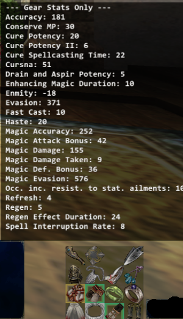
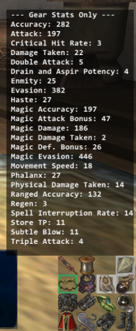
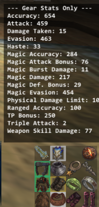

# GearInfo

This version of GearInfo is a lightweight Windower addon designed to track and display your equipment statistics in real-time. Unlike the older version which dealt with hardcoded stuffs, I'm using dynamic pattern matching (Regex) to read base stats and custom augments directly from your equipped items, ensuring your data is always accurate regardless of recent game updates or random gear rolls.  <b>You will NOT need to incoorporate this into GearSwap. This is stand-alone.</b>

## Features
* **Dynamic Parsing:** Automatically detects stats from base gear and custom augments (Oseem, Odyssey, etc.) using real-time game data. I handle complex augment strings and prevents double-counting of stats (e.g., differentiating between "Accuracy" and "Magic Accuracy").
* **Three-Window UI:** 
    * **Gear Stats:** Shows the total contribution of stats from your currently equipped gear.
    * **True Totals:** Eventually... This is just gear stats and checkparam for now.  I'm working on it.
    * **Detailed Log:** A 3-column breakdown showing exactly which items are contributing to your tracked stats.
* **Persistence:** All UI windows are draggable and will remember their position on your screen per character.

  
  
  

## Commands
Type the following into your FFXI chat log:

| Command | Description |
| :--- | :--- |
| `//gi refresh` | Forces a manual refresh of the UI and re-syncs character stats. |
| `//gi log` | Toggles the visibility of the 3-column detailed item breakdown log. |
| `//gi help` | Displays this help menu in your chat log. |

## Usage
1. Load the addon: `//lua load gearinfo`
2. The UI windows will appear on your screen.
3. **Click and drag** any window to move it where you prefer. Your layout is saved automatically.
4. When you swap gear, the addon will detect the equipment change and update the stats automatically.
5. If you want to see the breakdown of which items provide which stats, use `//gi log`.

## Technical Note
GearInfo calculates gear stats by parsing item descriptions and encrypted `extdata`. It calculates true character totals by silently polling the game's `/checkparam` function whenever equipment is changed, ensuring you have an accurate view of your total combat performance.
