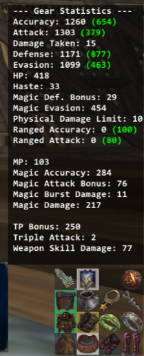
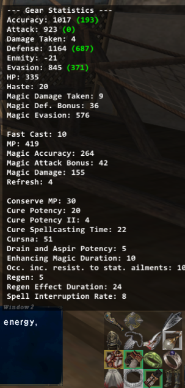
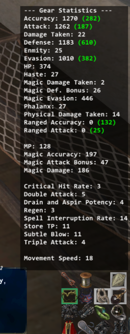
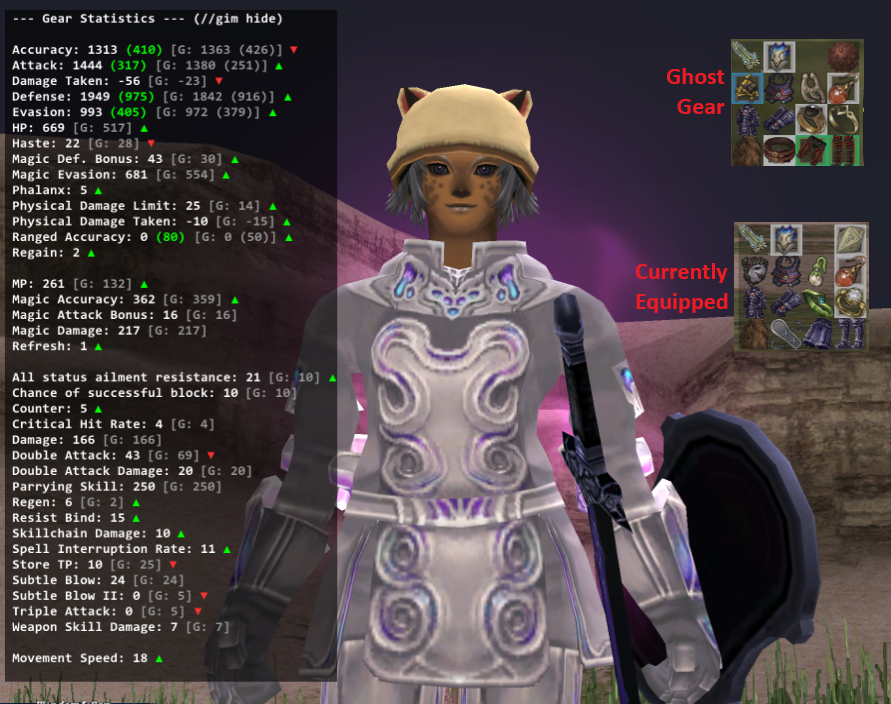

# GearInfo-Mod - Last updated September 8th 2026

**🚨 IMPORTANT: NOT THE LEGACY GEARINFO 🚨**  
*This is a completely rebuilt, standalone addon. It is designed to safely replace or run alongside the old, legacy "GearInfo" without breaking your existing GearSwap Luas. Legacy GearSwap files that heavily hardcoded the old addon will not crash or conflict, because this version uses a completely isolated folder (`GearInfo-Mod`) and command structure (`//gim`).*

**Status:** - Odyssey, Unity, JSE torques, Divergence, Limbus, Escha, REMA, and statless gear are fully integrated.

This version of GearInfo-Mod is a lightweight Windower addon designed to track and display your equipment statistics in real-time. Unlike the older version which dealt with hardcoded stuffs, I'm using dynamic pattern matching (Regex) to read base stats and custom augments directly from your equipped items(when applicable), ensuring your data is always accurate regardless of recent game updates or random gear rolls. I did have to create custom files and retrieve augments from BG-wiki that the community identified. All of that was manual entry death. Same for grabbing the ID of the equipment.  Death I say!

**You will NOT need to incorporate this into GearSwap. This is stand-alone.**

I was also limited to the data on bg-wiki.  `//gim log` will be your friend to verify if something is missing.

---

## 🛑 THE "/checkparam" MENU LIMITATION (PLEASE READ) 🛑

GearInfo-Mod calculates your **Green Gear Stats** instantly using local files, but relies on the game's native `/checkparam` command to fetch your **White Total Character Stats**. 

**Why `/checkparam`?** Extensive analysis of FFXI's network traffic confirms that the game **does not** transmit your total Attack, Accuracy, Defense, or Evasion via any known packets. The server only sends Base Stats (STR, DEX, etc.), leaving your client to calculate combat totals locally in RAM. Because local memory readers frequently fail to calculate complex external buffs correctly (like GEO bubbles, COR rolls, or specific food), forcing a `/checkparam` ping is the *only* way to guarantee 100% accurate, server-verified combat totals.

**The Limitation:** Final Fantasy XI strictly forbids the `/checkparam` command from executing while a full-screen menu (like the Equipment Menu) is open.

If you swap gear while your Equipment Menu is open:
1. Your green gear stats will update immediately.
2. The game will block the addon from fetching your new totals, generating a hidden error: *"You must close the currently open window to use that command."*
3. The addon will silently intercept this error and wait in the background. **Your white total stats will NOT update until you close the menu.** 

**To correctly use the Ghost Gear comparison tool:**
1. Equip your first gear set.
2. **Close all menus** so you are standing normally in the game world.
3. Type `//gim ghost save` to capture the snapshot.
4. Open your menu and swap to your second gear set.
5. **Close the menu again** to allow the addon to fetch your new true totals and accurately display the `▲` / `▼` comparison!

---

## Features
* **Dynamic Parsing:** Automatically detects stats from base gear and custom augments (Oseem, Odyssey, etc.) using real-time game data. I handle complex augment strings and prevents double-counting of stats (e.g., differentiating between "Accuracy" and "Magic Accuracy").
* **Odyssey, Unity, Limbus, Divergence, JSE Necks Rank Scaling:** Full support for Rank 1 through 30 (If applicable) path-based augment scaling via a dedicated `augments.lua` database, allowing perfect calculations of intermediate ranks. 
* **Ghost Gear System:** Save a "ghost" snapshot of your stats in memory. Your ghost stats hover next to your active stats in brackets `[G: ...]` so you can rapidly compare gear sets in real-time.
    * **Smart Comparisons:** The UI automatically calculates the difference between your active gear and your ghost snapshot, displaying a smooth, color-coded green ▲ or color-coded red ▼ to instantly show you what you're gaining or losing.
* **Customizable UI:** 
    * Toggle between **Vertical** (stacked) and **Horizontal** (side-by-side) layouts.
    * **Gear Stats:** Shows the total contribution of stats from your currently equipped gear.
    * **True Totals:** Accurately reflects your total character stats (white text) versus gear stats (green text).
    * **Detailed Log:** A 3-column breakdown showing exactly which items are contributing to your tracked stats.
* **Persistence:** All UI windows are draggable and will remember their position and layout preferences on your screen per character.

### ⚠️ REMA WeaponSkill Disclaimer
Rank 15 Ultimate Weapons (Relic, Empyrean, Mythic, Ergon, Aeonic) provide massive damage boosts to **specific** Weapon Skills (e.g., *Victory Smite: Damage +10%*). To prevent the UI from becoming bloated with 40+ unique weapon skill names, **these specific bonuses are aggregated into the general `Weapon Skill Damage` tracker.** 

When you see your Weapon Skill Damage increase upon equipping an R15 weapon, please be aware that this specific portion of the stat *only applies to the weapon's designated Weapon Skill!*

  
  
   
   

## Commands
Type the following into your FFXI chat log:

| Command | Description |
| :--- | :--- |
| `//gim refresh` | Forces a manual refresh of the UI and re-syncs character stats. |
| `//gim base` | Toggles the Base Stats (STR/DEX/etc.) UI window. |
| `//gim ghost save` | Saves a snapshot of your current stats to compare against. |
| `//gim ghost clear` | Deletes your saved Ghost Gear snapshot. |
| `//gim ghost toggle` | Hides or shows your Ghost Gear display. |
| `//gim log` | Toggles the visibility of the 3-column detailed item breakdown log. |
| `//gim export` | Dumps raw item descriptions and extdata to data/logs/export.txt for debugging. |
| `//gim export log` | Dumps parsed UI stats and warnings to data/logs/export_log.txt. |
| `//gim export ghost` | Dumps the currently saved Ghost stats memory block to data/logs/export_ghost.txt. |
| `//gim hide` | Hides the Gear Statistics UI completely. |
| `//gim show` | Shows the Gear Statistics UI. |
| `//gim style horizontal` | Changes the UI to a side-by-side layout. |
| `//gim style vertical` | Changes the UI back to a stacked layout. |
| `//gim validate` | Debug tool: Scans the database to ensure all stat keys match the UI dictionary. |
| `//gim help or //gim` | Displays this help menu in your chat log. |

## Completed Milestones
1. ~~Add Ody weapons and accessories.~~ DONE on 7/11/2026
2. ~~Add Unity stuffs~~ DONE on 7/14/2026
3. ~~Add Limbus stuffs~~ DONE on 7/20/2026
4. ~~Add Divergeance Stuffs~~ DONE on 7/21/2026
5. ~~Add JSE NQ, +1, +2 Stuffs~~ DONE on 7/21/2026
6. ~~Pet Augments is buggy~~ DONE on 7/12/2026 but testing
7. ~~Add REMA Augments~~ DONE on 7/24/2026
8. ~~Add Part 1 of Escha~~ DONE on 7/27/2026
9. ~~Add misc stuff like Brutal Earring. Statless descriptions in the gear. ie Enhances "Fast Cast" effect~~ DONE 7/28/2026
10. ~~Add Part 2 of Escha (Oboro, Weapons, Zi'tah Augments)~~ DONE 7/30/2026
11. ~~Overhauled Regex parsing engine for indestructible stat matching, resolved Pet stat bleeding, and added dual-export tools.~~ DONE 9/2/2026
12. ~~Fully modularized codebase (separated Parser, UI Renderer, Debugger, and Stat Dictionary into isolated classes) for extreme performance.~~ DONE 9/8/2026

## Usage
1. Create a folder in addons called `GearInfo-Mod`
2. Drop all of the files downloaded in this repo into `GearInfo-Mod` 
3. **IMPORTANT:** Create two empty folders named `logs` and `settings` inside the `GearInfo-Mod/data/` folder before launching!
4. From within the game in order to load the addon: `//lua load GearInfo-Mod`
5. Type `//gim` for commands but `//gim show` is the meat and potatoes
6. **Click and drag** any window to move it where you prefer. Your layout is saved automatically.
7. When you swap gear, the addon will detect the equipment change and update the stats automatically.
8. If you want to see the breakdown of which items provide which stats, use `//gim log`.
9. Use the `//gim ghost save` command before testing a new set to easily see exactly what you gain or lose across all stats (Remember to close your menus!).
10. Use the `//gim export` and `//gim export log` commands to troubleshoot missing stats if an item isn't parsing correctly.

## Technical Note
GearInfo-Mod calculates gear stats locally by parsing item descriptions and encrypted `extdata`. To calculate true character totals (Accuracy, Attack, Evasion, Defense), it utilizes a Two-Stage Injection System. Because there are no known packets that contain total combat stats, the addon silently intercepts the game's `/checkparam` text output. Green gear stats are calculated instantly, followed by a smart delay that waits for you to close any open menus before pinging `/checkparam` to prevent chat spam and server desync.

## Special Thanks
Thanks Zedoma and Navius for testing and giving me feedback for gear. The ghost idea came from Navius and I ran with it.